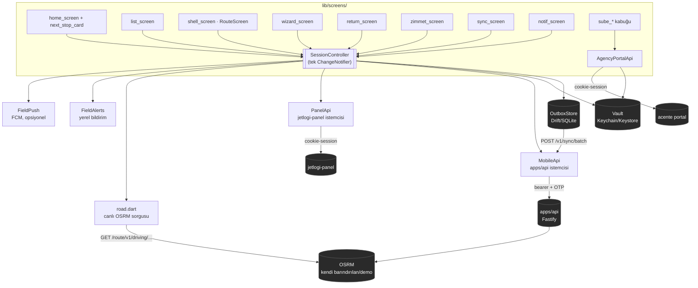
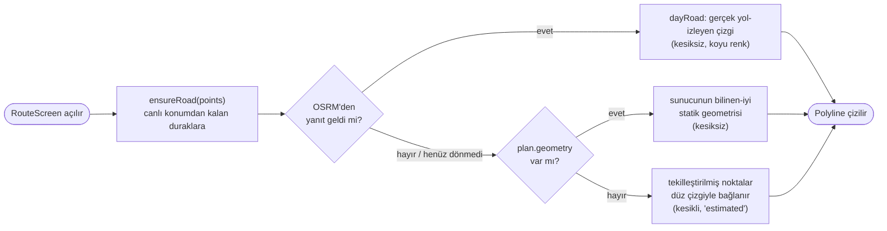
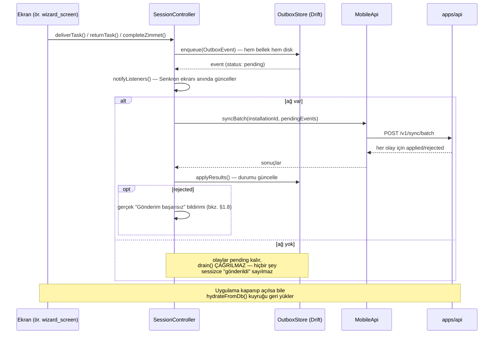

# JetLogi Kurye (dijigoo_kurye)

Kurye ve şube/acente saha uygulaması — Flutter. Kuryenin vardiya açması,
sıradaki durağa gitmesi, teslimat/iade akışını yürütmesi, zimmet (custody)
devretmesi, gün sonu ve eğitimi tamamlaması; şube personelinin gönderi /
kurye / stok / sayım / sevk kabuğunu kullanması için tek uygulama.
iOS + Android, tek kod tabanı.

---

## 1. Mimari

### 1.1 Genel şekil

```
lib/
├── main.dart              # bootstrap: Vault → DB → API client'lar → SessionController → runApp
├── app.dart                # AppPhase → ekran eşlemesi (splash/onboard/activation/.../main)
├── session.dart            # SessionController — TEK ChangeNotifier, tüm state burada
├── theme.dart               # Dg — design token'lar (renk/font/radius), Dg.dark bayrağı
├── models.dart               # DeliveryTask, AppNotification, OutboxEvent, vb. domain modelleri
├── widgets.dart               # Paylaşılan UI (DgCard, DgButton, StatusChip, MapStrip, ...)
├── l10n.dart                   # L10n — TR/EN string tablosu (Localizations değil, kendi sınıfımız)
├── road.dart                    # OSRM entegrasyonu (bkz. §1.7)
├── next_stop.dart                  # Sıradaki durak: faz, adres/randevu parse, 150 m eşik, statik harita URL
├── coach.dart                       # İlk-giriş tooltip / koç bayrakları
├── geo.dart                          # Polyline decode/encode + haversine
├── map_config.dart                    # Harita karo URL'i (Mapbox light-v11 / Esri World Street)
├── scan.dart                       # Barkod/QR tarama (kamera + manuel kod fallback)
├── signature.dart                   # İmza yakalama
├── locate.dart                       # Tek seferlik GPS okuma + izin istekleri (sürekli takip yok)
├── launchers.dart                     # Telefon arama, harici harita/yol tarifi açma
├── media_upload.dart                   # Kanıt fotoğrafı/dosya yükleme
├── alerts.dart                          # FieldAlerts — sistem tepsisi bildirimi (yalnız attach() ile açılır)
├── push.dart                             # FieldPush — FCM (yalnız dart-define + attach() ile açılır)
├── notif.dart                             # Bildirim filtreleme/gruplama yardımcıları
├── sync_label.dart                         # OutboxEvent → kuryeye gösterilecek insan-okur metin
├── brand.dart                               # JetLogi lockup (beyaz/renkli PNG)
├── shell_nav.dart                            # Alt sekme navigasyon yardımcıları
├── log.dart                                   # DgLog — halka tampon + dosyaya yazan yerel logger
├── api/
│   ├── client.dart                              # MobileApi — apps/api'ye (Fastify) HTTP istemcisi
│   ├── courier_tasks.dart                         # DeliveryTask ⇄ wire format dönüşümleri
│   ├── models.dart                                 # API DTO'ları (RoutePlanDto, CustodyItemDto, ...)
│   ├── panel_client.dart                            # PanelApi — jetlogi-panel'e cookie-session istemcisi
│   ├── panel_models.dart                             # Panel DTO'ları
│   ├── agency_client.dart                            # AgencyPortalApi — acente cookie-session
│   └── agency_models.dart                             # Acente DTO'ları
├── data/
│   ├── database.dart                                  # Drift (SQLite, şifreli) şeması
│   ├── outbox.dart                                     # Offline-first yazma kuyruğu (bkz. §1.6)
│   └── vault.dart                                       # Keychain/Keystore — token, DB anahtarı, installationId
└── screens/                                              # kurye + şube ekranları, bkz. §2
```

### 1.2 Bileşen diyagramı



### 1.3 Rota/harita akışı özeti (ayrıntı: §1.7)



**Neden bu sıra önemli:** aynı-adres grup özelliği yüzünden iki görev aynı
koordinatı paylaşabiliyor — tekilleştirme olmadan son-çare düz çizgi bir
durağa gidip aynı noktaya "geri sıçrıyormuş" gibi görünen bir zikzak
çiziyordu (bu oturumda bulunup düzeltildi, bkz. §1.7).

### 1.4 Offline-first yazma kuyruğu



### 1.5 State yönetimi

Tek `ChangeNotifier`: `SessionController` (`session.dart`, ~1600 satır).
Riverpod bunu `sessionProvider` ile expose eder; `main.dart` gerçek
bağımlılıklarla (`OutboxStore`, `MobileApi`, `PanelApi`, `Vault`) kurup
`ProviderScope`'a override eder. Testler kendi sahte/gerçek istemcileriyle
kurar (`SessionController(api: MobileApi(dio: mockDio))`).

`AppPhase` enum'u (`onboard/splash/activation/permissions/shift/main`)
`app.dart`'ta hangi ekranın gösterileceğini belirler — navigasyon bu tek
alan üzerinden yürür, ayrı bir router yok.

### 1.6 Offline-first yazma kuyruğu (outbox) — ayrıntı

Teslim/iade/zimmet/destek-talebi gibi her kuryenin yaptığı aksiyon önce
**yerel** `OutboxStore`'a (`data/outbox.dart`) bir `OutboxEvent` olarak
yazılır (Drift'e de kalıcı yazılır — `enqueue()` sıraya hem bellekte hem
diskte ekler). Ağ varsa `SessionController._flushOutbox()` bunu
`POST /v1/sync/batch`'e akıtır; sunucu her olay için `applied` / `rejected`
döner. Ağ yoksa (`catch` bloğu) olaylar **`pending` bırakılır**, bir sonraki
`pushSyncQueue()` çağrısında (yeniden online olunca) tekrar denenir —
`drain()` (her şeyi `applied` sayıp atma) yalnız `api`/`vault` gerçekten
`null` olduğunda çağrılır, ki bu bugün prod'da hiç olmayan bir durum.

Uygulama kapanıp açılsa bile (`hydrateFromDb()`) kuyruk diskten geri
yüklenir — hiçbir bekleyen teslim/iade sessizce kaybolmaz.

**Senkronizasyon ekranı** (`sync_screen.dart`) bu kuyruğu olduğu gibi
gösterir: bekleyen sayısı, başarısız sayısı (`status == 'rejected'`), her
olay için insan-okur etiket (`sync_label.dart`), "Verileri gönder" butonu
`pushSyncQueue()`'yu tetikler. Statik değil — gerçek kuyruk durumu.

### 1.7 Rota / harita sistemi — ayrıntı

İki ayrı rota kaynağı var, bilerek:

1. **`RoutePlanDto`** (`api/models.dart`) — sunucudan (`apps/api`'nin
   OSRM + 2-opt optimizer'ı, `POST /v1/routing/optimize`) veya offline'da
   `RoutePlanDto.demo()`'dan gelen, **optimize edilmiş durak sırası** +
   statik bir polyline. `session.dart`'taki `loadRoute()` bunu çeker.
2. **`RoadLeg`** (`lib/road.dart`) — kuryenin **canlı konumundan** kalan
   duraklara gerçek zamanlı, yol-izleyen bir çizgi. Bunun için doğrudan
   mobil istemciden bir OSRM sunucusuna `GET /route/v1/driving/...` atılır
   (`fetchRoadLeg()`), 5sn timeout + 1 retry ile (public demo OSRM sık
   düşüyor). Sonuç `SessionController._roadLegs` cache'ine yazılır.

   OSRM adresi `--dart-define=OSRM_URL=...` ile veriliyor; verilmezse
   herkese açık `router.project-osrm.org` demo sunucusuna düşer — bu,
   üretimde **asla** güvenilmemesi gereken bir fallback (rate-limit,
   kesinti garantisi yok). Kendi barındırdığımız OSRM (`infra/osrm`,
   `docker compose up -d osrm`, varsayılan `http://localhost:5001`) hem
   `apps/api`'nin optimizer'ı hem mobilin canlı-rota özelliği için aynı
   altyapı.

   **Ekranda gösterilen çizgi önceliği** (`shell_screen.dart`'taki
   `RouteScreen`): `dayRoad?.polyline ?? plan?.geometry` — yani önce canlı
   OSRM sonucu, o yoksa sunucunun/demo'nun bilinen-iyi statik geometrisi.
   Her ikisi de yoksa (ilk açılış anı, henüz fetch dönmemiş) noktalar
   tekilleştirilip (`_uniquePoints`) düz çizgiyle bağlanır — bu son çare
   yol ASLA gerçek bir polyline'ın yerine geçmez, sadece geçici bir "tahmin"
   göstergesidir (`estimated: true`, kesikli çizgi, farklı renk).

   Harita karoları (`map_config.dart`) **her zaman açık tema** (Mapbox
   `light-v11` veya anahtarsız Esri World Street). CartoDB anonim erişimi
   kapandığı için fallback Esri’dir. Rota çizgisi sabit koyu (`Dg.night`) —
   temaya uyan `Dg.ink` koyu temada kayboluyordu.

   Ana sayfa **Sıradaki durak** kartı canlı `FlutterMap` kullanmaz: Mapbox
   token varsa `dark-v11` statik snapshot, yoksa placeholder. Dokununca
   mevcut `RouteScreen` açılır. Varış eşiği 150 m; GPS yoksa kurye **Vardım**
   der, CTA **Teslime başla** olur ve sihirbaz açılır.

### 1.8 Bildirimler

`SessionController.notifications` artık **gerçek olaylardan** besleniyor,
statik bir demo listesi değil:

| Bildirim | Gerçek tetikleyici |
|---|---|
| Yeni durak atandı / iptal / çekildi | Görev senkron delta'sı (`_applyIncomingTasks`) önceki/yeni listeyi karşılaştırır |
| Zimmet onaylandı | `completeZimmet()` gerçek şube devri başarılı dönünce |
| Gönderim başarısız | `_flushOutbox()` bir olayı sunucudan `rejected` olarak geri alınca |

Okundu/kapatıldı durumu id-bazlı, `Vault`'ta kalıcı
(`readNotificationIds`/`dismissedNotificationIds`) — ekran yeniden
açılınca ya da uygulama kapanıp açılınca sıfırlanmaz.

### 1.9 Kimlik doğrulama / veri kaynağı

İki ayrı istemci bilerek bir arada:

- **`MobileApi`** (`api/client.dart`) — `apps/api` (Fastify)'a bearer
  token + OTP ile. Teslim/iade/zimmet/senkron akışının bugünkü gerçek
  kaynağı.
- **`PanelApi`** (`api/panel_client.dart`) — jetlogi-panel'e cookie-session
  ile. Şu an yalnız profil/kimlik bilgisi çekmek için kullanılıyor
  (`loginWithPanel`/`hydratePanelSession`); görev/senkron akışını **henüz**
  devralmadı (bkz. §4, Linear JETLOG-20).

---

## 2. Ekranlar

`lib/screens/` — kurye kabuğu + şube/acente kabuğu.

| Ekran | Ne işe yarar |
|---|---|
| `splash_screen.dart` | Marka açılışı, "Vardiyaya başla" |
| `onboard_screen.dart` | 3 adımlık ilk-kullanım tanıtımı |
| `activation_screen.dart` | SMS-OTP veya panel şifresiyle giriş |
| `permissions_screen.dart` | Konum/kamera/bildirim izinleri kapısı |
| `shift_screen.dart` | Vardiya açılış selfie'si |
| `kyc_screen.dart` | Kimlik doğrulama (MRZ/NFC okuma) |
| `home_screen.dart` | Ana sayfa — sıradaki durak kartı üstte, vardiya özeti, senkron/bildirim |
| `next_stop_card.dart` | Sıradaki durak: snap pager, statik harita, Vardım / Yol tarifi / Teslime başla |
| `list_screen.dart` | Dağıtım listesi (Rota sekmesi) — aynı-adres gruplama dahil |
| `shell_screen.dart` | Alt sekme iskeleti + `RouteScreen` (dikey zaman çizelgeli harita) |
| `task_detail_screen.dart` | Tek görev detayı |
| `wizard_screen.dart` | Teslimat adımları (kim aldı → kapı foto → kod/imza) |
| `result_screen.dart` | Teslimat sonucu (başarılı/başarısız) |
| `return_screen.dart` | İade / teslim-edilemedi (`fail_screen` yerine) |
| `eod_screen.dart` | Kurye gün sonu |
| `training_screen.dart` / `training_detail_screen.dart` | Saha eğitim modülleri |
| `zimmet_screen.dart` | Kurye/Şube zimmet tarama ve devir |
| `envanter_screen.dart` | Kod ile envanter/koli girişi |
| `depo_screen.dart` | Depodan alım |
| `sync_screen.dart` | Senkron kuyruğu — gerçek bekleyen/başarısız durumu |
| `tara_screen.dart` | Alt sekme kısayolu — kurye/şube zimmet tarama akışına götürür |
| `notif_screen.dart` | Bildirimler |
| `support_screen.dart` | Destek talebi aç/listele |
| `earnings_screen.dart` | Performans/prim özeti |
| `profile_screen.dart` | Kurye profili + (5 dokunuşla) gizli mühendis/debug paneli |
| `menu_screen.dart` | Ayarlar, tema/dil, oturum kapatma, diğer ekranlara giriş |
| `sube_login_screen.dart` | Acente portal girişi |
| `sube_shell_screen.dart` | Şube alt sekme kabuğu |
| `sube_home_screen.dart` | Şube ana sayfa sayaçları |
| `sube_shipments_screen.dart` | Gönderiler |
| `sube_couriers_screen.dart` | Kuryeler |
| `sube_stock_screen.dart` | Stok & zimmet |
| `sube_count_screen.dart` | Sayım |
| `sube_dispatch_screen.dart` | Merkeze sevk |
| `sube_eod_screen.dart` | Şube gün sonu |

---

## 3. Çalıştırma

```bash
flutter pub get
flutter run \
  --dart-define=MAPBOX_TOKEN=pk.xxxxx \
  --dart-define=OSRM_URL=http://localhost:5001
```

- `MAPBOX_TOKEN` yoksa rota haritası Esri World Street karolarına düşer.
  Sıradaki durak kartı token yoksa snapshot yerine placeholder gösterir.
- `OSRM_URL` yoksa herkese açık demo OSRM'e düşer — yerelde
  `docker compose up -d osrm` ile kendi OSRM'imizi ayağa kaldırıp ona
  işaret etmek tercih edilmeli (§1.4).
- `apps/api` ayakta değilse uygulama demo/mock veriyle çalışır
  (`api/client.dart`'taki interceptor'lar gerçekçi sahte cevaplar döner).
- FCM push (`push.dart`) yalnız `FCM_API_KEY`/`FCM_APP_ID`/vb. dart-define
  verilirse aktifleşir — verilmezse hiç dokunulmaz, demo/test etkilenmez.

## 4. Test ve CI

```bash
flutter analyze
flutter test
```

`.github/workflows/mobile-ci.yml` — `apps/mobile/**` altına her push/PR'da
`flutter analyze` + `flutter test` otomatik çalışır (format kontrolü
bilerek yok — geniş bir formatlama borcu birikmiş, format hatası gerçek
regresyonların sinyalini boğar; ayrı bir formatlama geçişiyle eklenmeli).

## 5. Bilinen açık noktalar

- **Veri kaynağı geçişi** — mobil hâlâ `apps/api`/demo interceptor'a bağlı;
  jetlogi-panel'in gerçek courier API'sine geçiş yapılmadı (Linear JETLOG-20).
- **Crash/hata telemetrisi yok.** Sentry denendi, geri alındı: bu geliştirme
  ortamında Swift Package Manager `sentry-cocoa`'yı GitHub'dan indiremedi
  (8+ dk asılı kaldı). Firebase Messaging'in de aynı sınıf native
  bağımlılığı var (`firebase-ios-sdk`) — build'i gerçek cihazda/CI'da
  doğrulamak gerek, bu ortamda doğrulanamadı.
- **`notif`/`sync`/`zimmet`/`return` ekranlarının** elle, canvas-referanslı
  tasarım geçişi hâlâ yapılmadı — yalnız ortak token'lardan (DgCard/
  StatusChip/Dg.*) otomatik pay aldılar.
- **Şube 5 modül** kabuk olarak duruyor; acente portalda çoğu liste/detay
  ucu henüz yok (`docs/08-sube-acente-entegrasyonu.md`).
- **Açık tema** yeni canlı doğrulandı, kapsamlı bir ekran-ekran denetim
  değil.

Daha geniş bağlam ve mimari kararlar için repo kökündeki `docs/` ve
Linear (JETLOG projesi — güncel durumun asıl kaynağı, bu README bir
görüntü/snapshot) bakılmalı.
